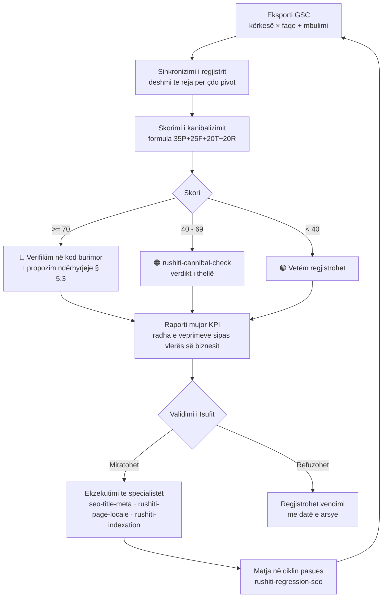
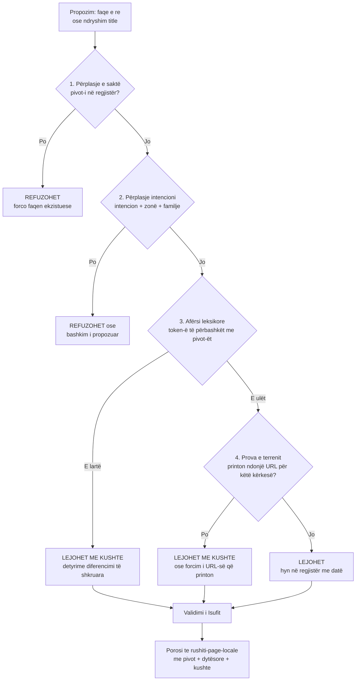

# Propozim & plan zhvillimi — skill-i ultra-premium `rushiti-keyword-map`

**Strategjia e fjalëve kyçe, caktimi i tyre për çdo faqe dhe parandalimi i kanibalizimit — rushiti-renovation.fr**

| | |
|---|---|
| Data | 21/08/2026 |
| Statusi | Propozim — asgjë nuk zbatohet pa miratimin e Isufit |
| Siti i mbuluar | rushiti-renovation.fr (një sit për audit; rushiti.fr trajtohet veçmas) |
| Bazuar në | Auditin e fjalëve kyçe të 20/08/2026 (`audit-mots-cles-cibles-2026-08.md`), matricën e 40 cluster-ëve, të dhënat reale të Search Console 17/05–16/08/2026 dhe kodin burimor të sitit në prodhim |
| Gjuha e dokumentit | Shqip (me kërkesë); fjalët kyçe mbeten në frëngjisht, sepse ashtu i shkruajnë klientët në Google |

---

## Ç'duhet mbajtur mend, në dhjetë rreshta

Siti ka sot **1 395 URL**, nga të cilat **1 368 janë një grilë «shërbim × zonë»** (18 shërbime × 76 zona), ndërsa Search Console i tregon impresione vetëm **217 faqeve** — pra Google nuk e shfaq kurrë ~85 % të sitit. Në tre muaj: **52 klikime, 5 670 impresione, CTR 0,9 %, pozicion mesatar 14,3**. Kanibalizimi nuk është hipotezë, është i dokumentuar: dy çifte shërbimesh konkurronin me njëri-tjetrin **në të 76 zonat njëherësh** (papier peint / toile de verre — i korrigjuar, në pritje të shpërndarjes; isolation / isolation intérieure — për t'u gjykuar me të dhëna), plus dubloni i fasadës në Besançon. Skill-et ekzistuese të suitës RUSHITI e **zbulojnë** kanibalizimin pasi ka ndodhur dhe e **auditojnë** ciblimin një herë në kohë; ajo që mungon është shtresa e përhershme e qeverisjes: **një regjistër kanonik faqe ↔ fjalë kyçe**, një **portë verifikimi përpara se të krijohet çdo faqe e re**, sinkronizim i rregullt me Search Console dhe një raport mujor KPI. Ky është roli i `rushiti-keyword-map`. Parimi i tij i parë trashëgohet nga e gjithë suita: **asnjë shifër e shpikur, asnjë premtim renditjeje** — aty ku mungon e dhëna, shkruhet `PV` (për validim), kurrë një numër i sajuar.

---

## 1. Baza faktike — dhe korrigjimi i draftit paraprak

Një draft paraprak i qarkulluar për këtë temë e përshkruante sitin me **6 faqe** (kryesore, à-propos, contact, blog, dy faqe shërbimi) dhe rekomandonte ndërtimin e një arkitekture `/services/…` nga zeroja. Verifikimi në burime — sitemap-et e sitit, kodi burimor i depozitës së prodhimit (`eurotregu/rushiti-renovation`) dhe Search Console — tregon një realitet krejt tjetër, dhe kjo ndryshon rrënjësisht se çfarë skill-i duhet ndërtuar:

| Pretendimi i draftit paraprak | Fakti i verifikuar |
|---|---|
| Siti ka ~6 faqe; duhen krijuar faqet e shërbimeve | Siti ka **1 395 URL**; problemi nuk është mungesa e faqeve, por **mbiprodhimi pa arbitrazh** (produkt kartezian 18 × 76) |
| Ekziston një faqe `/rafraichissement-piscines-besancon/` me përmbajtje të gabuar | Kjo URL nuk ekziston në sitin aktual. Gjurma «piscines» është reale, por vjen nga **faqet e trashëguara të WordPress-it të vjetër** që ende shfaqen në Google (piscines 8 impresione, bardage métallique 88, restauration de meubles 78, désamiantage 19…) — pra problemi i vërtetë është pastrimi i trashëgimisë, jo një URL e shkruar keq |
| Duhen vëllime kërkimi «2 400/muaj», «320/muaj» etj. | **Asnjë burim vëllimesh nuk është i lidhur sot** (Semrush jo, Keyword Planner jo; NeuronWriter nuk kthen vëllime). Shifrat e draftit ishin të pasqarueshme. E vetmja e dhënë e vërtetë e kërkesës që kemi janë **impresionet reale të GSC** — dhe ato përdoren në këtë dokument |
| Duhet rindërtuar struktura e URL-ve në `/services/…` | Slug-et e sheshta (`/peinture-interieure-besancon`) janë **konventa ekzistuese, e indeksuar dhe që printon**. Një ristrukturim masiv URL-sh për arsye estetike do të digjte kapital SEO pa asnjë përfitim — **nuk rekomandohet** |

Ky korrigjim nuk është pedanteri: një skill «ultra-premium» i ndërtuar mbi një fotografi të gabuar të sitit do të optimizonte një sit që nuk ekziston. Gjithçka më poshtë mbështetet vetëm në të dhëna të verifikuara, me burimin e cituar.

### 1.1 Të dhënat bazë të ndërmarrjes (burimi i së vërtetës)

| Element | Vlera |
|---|---|
| Ndërmarrja | SARL RUSHITI Rénovation — SIRET 905 214 631 00012 |
| Drejtues | Isuf dhe Yll Rushiti |
| Adresa | 18 rue du Professeur Haag, 25000 Besançon |
| Kontakt | 07 60 27 98 97 — contact@rushiti-renovation.fr |
| Përvoja | 20 vjet mbi ndërtesat e Besançon-it dhe Franche-Comté-së |
| Sigurime | Décennale + RC pro (ERGO France) — ⚠️ faqet e grilës citojnë «Phénix / Tétris»: mospërputhje për t'u korrigjuar |
| Konformiteti | DTU 59.1 (bojatisje), DTU 25.41 (pllaka gipsi) |
| Klientela | Particuliers, syndics, gestionnaires, bailleurs, sigurime (dégât des eaux) |
| Zona | Besançon (të gjitha lagjet) + departamenti Doubs (25) |
| Oferta dalluese | Diagnostikë teknike falas në vend, devis i detajuar pa angazhim |

### 1.2 Fotografia reale e performancës (GSC, 17/05–16/08/2026)

| Tregues | Vlera reale |
|---|---|
| Klikime (3 muaj) | 52 |
| Impresione | 5 670 |
| CTR mesatar | 0,9 % |
| Pozicioni mesatar | 14,3 |
| Faqe me impresione | 217 nga 1 395 (≈ 15,6 %) |
| Tendenca 28-ditore | Impresione **+62 %**, por pozicioni **−2 vende** dhe CTR **−33 %** — nënshkrimi klasik i një grile tepër të gjerë: faqet e reja hyjnë në faqet 2–4 të Google dhe shtojnë impresione pa klikime |

---

## 2. Analiza e strukturës së faqeve

### 2.1 Arkitektura ekzistuese, shtresë për shtresë

Shtresat më poshtë janë të ndara pa mbivendosje, sipas inventarit të auditit të 20/08 (1 368 + 10 + 7 + 11 ≈ 1 395 URL; faqet pilar «shërbim + Besançon» si `/peinture-interieure-besancon` numërohen brenda grilës, si zona Besançon):

| Shtresa | URL / model | Sasia | Gjendja e verifikuar |
|---|---|---|---|
| Grila «shërbim × zonë» (përfshirë Besançon si zonë) | `/<shërbim>-<zonë>` | 1 368 | Përmbajtje e mirë (~1 400 fjalë, paragrafë vërtet lokalë, FAQ, maillage), por **pa asnjë arbitrazh cibli**: Champoux (~90 banorë) trajtohet si Pontarlier. Krerët e saj të varrosur: `/platrerie-besancon` poz. 21,1; `/isolation-besancon` 184 impresione, 0 klikime, poz. 28,3 |
| Faqe pilar & B2B jashtë grile | `/plaquiste-besancon`, `/renovation-appartement-besancon`, `/prix-travaux-renovation-besancon`, `/renovation-syndic-gestionnaire-besancon`, `/remise-en-etat-logement-locatif-besancon`, `/amenagement-commerce-bureau-besancon`, `/devis-assurance-degat-des-eaux-besancon`… | 10 | Të mbuluara mirë; silo-ja më e lidhur me vlerën e biznesit |
| Blog | `/blog/…` | 11 | Artikuj që synojnë simptoma reale; `/blog/moisissure-plafond-salle-de-bain-besancon` ka **1 257 impresione** — dëshmi që aksi informativ funksionon |
| Faqe utilitare (përfshirë faqen kryesore) | `/` (20 klikime / 1 808 impresione / poz. 11,4 — faqja më e dukshme), contact (177 impr., poz. 6,6), à-propos, réalisations, zones, mentions, simulateur | 7 | Faqja kryesore + një artikull blogu përqendrojnë 62 % të gjithë dukshmërisë |
| Trashëgimi WordPress | URL të vjetra jashtë katalogut | jashtë numërimit | Ende printojnë (~200 impresione në shërbime që s'ofrohen) — për pastrim |

### 2.2 Modeli i synuar: tre nivele zonash (palier), jo grilë uniforme

Propozimi i auditit të 20/08/2026, të cilin skill-i i ri do ta administrojë dhe do ta kushtëzojë me të dhëna:

| Niveli | Zonat | Shërbime të mbajtura | Faqe |
|---|---|---|---|
| **A — Bërthama** | Besançon + 13 lagjet e tij (14 zona) | të 18-a | 252 |
| **B — Polet & kurora e dendur** | Pontarlier, Montbéliard, École-Valentin, Thise + 20 komuna të tjera (24 zona) | 10 | 240 |
| **C — Fshatrat** | 38 zonat e mbetura | 5 | 190 |
| **Gjithsej pas konsolidimit** | | | **≈ 682** (nga 1 368) |

Çdo faqe e hequr ridrejtohet **301 te i njëjti shërbim në nivelin më të lartë** (p.sh. `/vitrification-parquet-champoux` → `/vitrification-parquet-besancon`), kurrë te faqja kryesore. **Kusht i panegociueshëm:** asnjë faqe që printon në Search Console nuk fshihet, cilido qoftë niveli i saj teorik — skill-i i ri e bën këtë kusht të verifikueshëm mekanikisht (shih § 6.4).

### 2.3 Faqet e ardhshme të nevojshme (boshllëqe të verifikuara, jo lista gjenerike)

Silo «Rénovation de pièce» — më pranë çmimit mesatar të lartë — ka sot **një faqe të vetme** nga gjashtë silo referimi. Radha e krijimit, e trashëguar nga auditi dhe e administruar nga skill-i i ri:

| Prio | URL e propozuar | Title i propozuar (≤ 60 shenja) | Cluster-i i shërbyer |
|---|---|---|---|
| 1 | `/renovation-salle-de-bain-besancon` | `Rénovation de salle de bains à Besançon \| RUSHITI` | rénovation salle de bains besançon |
| 2 | `/entreprise-renovation-besancon` | `Entreprise de rénovation à Besançon \| RUSHITI` | entreprise de rénovation besançon — kërkesa «çati» e zanatit, sot pa faqe |
| 3 | `/renovation-cuisine-besancon` | `Rénovation de cuisine à Besançon \| RUSHITI` | rénovation cuisine besançon |
| 4 | `/expert-assurance-sinistre-besancon` | `Sinistres : artisan pour experts à Besançon \| RUSHITI` | eksperti i sigurimeve / kabineti i sinistrave (B2B) |
| 5 | *(pasurim, jo krijim)* | — | 18 faqet e Pontarlier thellohen me përmbajtje Haut-Doubs përpara çdo zone të re |

Ajo që **nuk** rekomandohet: hapja e komunave të reja. Problemi i sitit nuk është shtrirja gjeografike — është thellësia aty ku kërkesa ekziston.

---

## 3. Përgatitja e fjalëve kyçe kryesore

### 3.1 Metodologjia e vëllimeve — rregulli i parë i skill-it

Sot **asnjë burim vëllimesh mujore nuk është i lidhur** (Semrush i palidhur; NeuronWriter nuk kthen as vëllim, as vështirësi). Prandaj në tabelat e mëposhtme:

- kolona **«Dëshmi kërkese»** mban vetëm shifra reale — impresionet dhe pozicionet nga Search Console 17/05–16/08/2026;
- ku s'ka të dhënë, shkruhet **`PV`** (*për validim* — me Google Keyword Planner ose Semrush, veprimi i parë i Fazës 1);
- kolona **«Vështirësia»** është cilësore (e ulët / mesatare / e lartë), e gjykuar nga natyra e konkurrencës lokale, dhe rikalibrohet sapo të hyjnë të dhënat.

Ky disiplinim nuk është kufizim — është **tipari dallues** i skill-it: një hartë fjalësh kyçe ku çdo shifër ka burim të citueshëm vlen; një hartë me vëllime të shpikura është dekor.

### 3.2 Fjalë kyçe transaksionale (klienti gati për veprim)

| Fraza kyçe (frëngjisht) | Dëshmi kërkese (GSC 3 muaj) | Vështirësia | Faqja e caktuar |
|---|---|---|---|
| devis peinture besançon | PV | e ulët | `/contact` + CTA në faqet pilar |
| devis dégât des eaux assurance besançon | PV | e ulët | `/devis-assurance-degat-des-eaux-besancon` |
| prix travaux rénovation besançon | PV | mesatare | `/prix-travaux-renovation-besancon` |
| prix peinture m² besançon | PV | mesatare | `/blog/prix-peinture-interieure-besancon-2026` |
| artisan peintre besançon urgence | PV | e ulët | `/degat-des-eaux-besancon` (urgjenca reale e zanatit) |

### 3.3 Fjalë kyçe komerciale (klienti krahason ofrues)

| Fraza kyçe | Dëshmi kërkese (GSC 3 muaj) | Vështirësia | Faqja e caktuar |
|---|---|---|---|
| entreprise de peinture à besançon | **37 impresione, poz. 3,3, 0 klikime** | mesatare | `/peinture-interieure-besancon` |
| peintre besançon | **20 impresione, poz. 4,4, 0 klikime** | mesatare | `/peinture-interieure-besancon` |
| plaquiste besançon | **31 impresione, poz. 6,2, 0 klikime** | mesatare | `/plaquiste-besancon` |
| peintre en bâtiment besançon | **7 impresione, poz. 1,3** | e ulët | `/peinture-interieure-besancon` |
| entreprise de rénovation besançon | PV | mesatare | `/entreprise-renovation-besancon` (për t'u krijuar, P2) |
| ravalement façade besançon | PV | mesatare | **një** nga dy faqet e fasadës (verdikt në pritje — § 5.3) |
| enduit à la chaux besançon | **30 impresione, poz. 5,8, 0 klikime** | e ulët | pa faqe sot — kandidate për arbitrazh (bâti ancien) |
| rénov bois besançon | **58 impresione, poz. 6,2, 0 klikime** | e ulët | pa faqe — për arbitrazh me Isufin (a mbulohet drurë/parket?) |

> Rreshtat me shifra të theksuara ilustrojnë **gisement-in e menjëhershëm**; totali i sitit për kërkesat në top 6 pa asnjë klikim është **249 impresione** (analiza Drive 19/08, përfshin edhe kërkesa të palistuara këtu) — problem snippet-i (title/meta), jo problem renditjeje. Gjendja e korrigjimeve: shih addendum-in e 21/08 në fund të dokumentit.

### 3.4 Fjalë kyçe informative (klienti kërkon të kuptojë — blogu)

| Fraza kyçe | Dëshmi kërkese | Vështirësia | Faqja e caktuar |
|---|---|---|---|
| moisissure plafond salle de bain | **1 257 impresione, poz. 12,9** (artikulli ekzistues) | mesatare | `/blog/moisissure-plafond-salle-de-bain-besancon` |
| dégât des eaux qui paie quoi (IRSI) | PV | e ulët | `/blog/degat-des-eaux-assurance-qui-paie-quoi` |
| réparer plafond après fuite | PV | e ulët | dy artikujt ekzistues të blogut |
| mur froid condensation que faire | PV | e ulët | artikull për t'u shkruar (tetor 2026) |
| fissure plafond quand s'inquiéter | PV | e ulët | artikull për t'u shkruar (nëntor 2026) |
| prix placo au m² | PV | mesatare | artikull për t'u shkruar (dhjetor 2026) |
| ITI ou ITE que choisir | PV | mesatare | `/blog/isolation-interieure-iti-perte-de-place-epaisseur` |
| TVA 10 % ou 5,5 % travaux | PV | mesatare | artikull për t'u shkruar (shkurt 2027) — gjithmonë i kushtëzuar, kurrë i prerë |

Rregulli i silos informative: **çdo artikull ekziston për të shtyrë një faqe shërbimi me maillage**, kurrë për vetveten.

### 3.5 Fjalë kyçe naviguese (marka)

| Fraza kyçe | Dëshmi kërkese | Statusi |
|---|---|---|
| rushiti renovation / rushiti besançon | kërkesa e markës del në **poz. 22,1** | 🔴 Anomali — kërkesa e vet markës duhet të dalë e para; e lidhur me trashëgiminë WordPress dhe sinjalin e ndarë `www`/jo-`www` → `rushiti-indexation` + `rushiti-audit-site` |

### 3.6 Pseudo-fjalët kyçe — lista e zezë

Auditi gjeti që **22 nga 46 analizat** NeuronWriter ishin harxhuar në «kërkesa» që askush nuk i shkruan («intervention 24/7 peinture besançon», «peinture écologique besançon disponible vite»…). Skill-i i ri mban një **listë të zezë të mostrave** (fjalë disponibiliteti: *disponible, immédiat, 24/7, rapide, urgence* si prapashtesë reklamash; slug-e URL-sh; vargje marke; emra sigurimesh të palëve të treta) dhe **refuzon automatikisht** çdo hyrje të tillë në regjistër. Kredia analitike shpenzohet vetëm për kërkesa që një banor i Besançon-it mund t'i shkruajë vërtet.

---

## 4. Caktimi strategjik i fjalëve kyçe për çdo faqe

Ky seksion është bërthama e regjistrit që skill-i do ta mbajë si **burim i vetëm i së vërtetës** (`docs/seo/regjistri-fjale-kyce.csv`). Parimi: **një faqe = një intencion = një frazë kyçe primare**; fjalët dytësore mbështesin të njëjtin intencion, kurrë një intencion tjetër. Më poshtë harta për faqet me peshë; grila e plotë (682 faqe pas konsolidimit) ndjek të njëjtin model `<shërbim> <zonë>` të trashëguar nga faqja pilar përkatëse.

### 4.1 Faqet pilar dhe transversale

| Faqja | Fjala kyçe primare | Fjalë kyçe dytësore (2–3) | Dëshmi kërkese & vështirësi |
|---|---|---|---|
| `/` (accueil) | peintre & plaquiste à Besançon | entreprise rénovation intérieure besançon · artisan peintre doubs | 1 808 impr., poz. 11,4 · mesatare |
| `/peinture-interieure-besancon` | peintre besançon | entreprise de peinture besançon · peinture appartement besançon · peintre en bâtiment | 189 impr. faqja + 64 impr. kërkesat top-6 · mesatare |
| `/plaquiste-besancon` | plaquiste besançon | pose placo besançon · artisan plaquiste doubs | 31 impr., poz. 6,2 · mesatare |
| `/platrerie-besancon` | plâtrerie placo besançon | reprise plâtre ancien · plafond placo besançon | 481 impr., poz. 21,1 · mesatare |
| `/cloisons-besancon` | pose de cloison besançon | créer une pièce appartement · cloison placo prix | 85 impr., poz. 34,3 (Drive 19/08) · e ulët |
| `/faux-plafonds-besancon` | faux plafond besançon | plafond suspendu ba13 · faux plafond phonique | 28 impr., poz. 48,0 (Drive 19/08) · e ulët |
| `/isolation-besancon` | isolation besançon (çati: combles + fonike) | isolation combles besançon · isolation phonique appartement | 184 impr., poz. 28,3 — **për forcim, jo për prekje title-i** · mesatare |
| `/isolation-interieure-besancon` | isolation intérieure (ITI) besançon | isolation mur froid · doublage isolant | PV · mesatare |
| `/papier-peint-besancon` | papier peint besançon (pose) | pose papier peint tapissier · papier peint intissé | 181 impr., poz. 14,1 · e ulët |
| `/toile-de-verre-besancon` | toile de verre besançon | pose toile de verre plafond · fibre de verre à peindre | 83 impr., poz. 36,4 — matje pas dé-duplikimit · e ulët |
| `/revetements-sol-besancon` | pose revêtement de sol besançon | sol PVC lino besançon · pose parquet stratifié | 181 impr., poz. 29,6 (Drive 19/08) · mesatare |
| `/ratissage-enduit-besancon` | ratissage enduit de lissage besançon | enduit de lissage mur · préparation murs avant peinture | 387 impr., poz. 18,6 + 24 impr. IA (Drive 19/08) · e ulët |
| `/degat-des-eaux-besancon` | dégât des eaux besançon (rimëkëmbje) | réparation plafond dégât des eaux · assèchement mur après fuite | **18 impr., poz. 20,0 — silo më fitimprurëse, më e padukshme: prioriteti 1 i forcimit** · e ulët |
| faqja e fasadës (verdikt § 5.3) | ravalement façade besançon | peinture façade · crépi façade besançon | 59 impr. (te `/peinture-exterieure-besancon`) · mesatare |

### 4.2 Faqet B2B (klientela profesionale)

| Faqja | Fjala kyçe primare | Fjalë kyçe dytësore | Dëshmi & vështirësi |
|---|---|---|---|
| `/renovation-syndic-gestionnaire-besancon` | travaux copropriété besançon (syndic) | peinture cage d'escalier · rénovation parties communes | PV · e ulët |
| `/remise-en-etat-logement-locatif-besancon` | remise en état locative besançon | rénovation entre deux locataires · peinture logement locatif | PV · e ulët |
| `/amenagement-commerce-bureau-besancon` | aménagement commerce bureau besançon | rénovation local commercial · travaux bureau besançon | PV · e ulët |
| `/devis-assurance-degat-des-eaux-besancon` | devis dégât des eaux pour assurance | devis sinistre IRSI · artisan agréé assurance (⚠ pa premtuar «agrément» të pavërtetuar) | PV · e ulët |
| `/expert-assurance-sinistre-besancon` *(P4, e re)* | artisan pour expert d'assurance besançon | cabinet gestion sinistres · chiffrage sinistre bâtiment | PV · e ulët |

### 4.3 Faqet e reja të silos «Rénovation de pièce»

| Faqja (për t'u krijuar) | Fjala kyçe primare | Fjalë kyçe dytësore | Dëshmi & vështirësi |
|---|---|---|---|
| `/renovation-salle-de-bain-besancon` | rénovation salle de bains besançon | refaire salle de bain prix · rénovation douche besançon | PV · mesatare |
| `/entreprise-renovation-besancon` | entreprise de rénovation besançon | rénovation maison besançon · société de rénovation doubs | PV · e lartë (kërkesa çati) |
| `/renovation-cuisine-besancon` | rénovation cuisine besançon | refaire cuisine appartement · peinture meuble cuisine | PV · mesatare |
| `/renovation-appartement-besancon` (ekziston) | rénovation appartement besançon | rénovation appartement ancien · rénovation complète appartement prix | PV · mesatare |

### 4.4 Rregullat e trashëgimit për grilën lokale

Faqet `<shërbim>-<zonë>` **nuk marrin** fjalë kyçe të vetat në regjistër — ato trashëgojnë pivot-in e faqes pilar të shërbimit + emrin e zonës (p.sh. `cloisons-pontarlier` → «pose de cloison pontarlier»). Kjo mbyll derën e kanibalizimit brenda të njëjtit shërbim dhe e bën regjistrin të administrueshëm: **~40 cluster-ë qeverisin 682 faqe**, në vend që 682 faqe të kenë 682 rreshta arbitrarë.

---

## 5. Mekanizmi i parandalimit të kanibalizimit

Kanibalizimi SEO: dy a më shumë faqe të të njëjtit sit konkurrojnë për të njëjtën kërkesë, Google luhatet mes tyre dhe të dyja renditen më poshtë sesa do të renditej njëra e vetme. Në këtë sit fenomeni s'është teorik — është vërtetuar në shkallë industriale (2 çifte × 76 zona = 304 faqe në konkurrencë të brendshme *nga ndërtimi*). Mekanizmi ka katër shtylla: **auditi**, **rregullat e diferencimit**, **protokolli i ndërhyrjes** dhe **porta parandaluese**.

### 5.1 Auditi i përmbajtjes ekzistuese (detektimi)

Procedura standarde, me ritëm mujor pas çdo eksporti të ri GSC:

1. **Eksporti kryq «kërkesë × faqe»** nga Search Console (jo dy eksporte të veçuara — vetëm kryqëzimi tregon se cila URL printon për cilën kërkesë).
2. **Grupimi**: për çdo kërkesë me impresione, lista e URL-ve që shfaqen për të.
3. **Flamurimi**: çdo kërkesë ku ≥ 2 URL marrin impresione dhe të paktën njëra është nën pozicionin 20 shënohet si konflikt potencial.
4. **Verifikimi në kod burimor** — mësimi metodologjik i auditit të 20/08: *një title i lexuar në SERP a në një indeks të tretë nuk është title i sitit* (Google i rishkruan titujt; kështu u pafajësua gabimisht i akuzuari çift isolation/ITI, që në kod i ka balizat të diferencuara). Asnjë verdikt kanibalizimi pa e hapur kodin e të dy faqeve.
5. **Verdikti dhe skorimi** (§ 6.4), me radhë veprimi sipas vlerës së biznesit të silos.

### 5.2 Rregullat e diferencimit të intencionit

| Rregulli | Formulimi operacional | Shembull real nga siti |
|---|---|---|
| **1 faqe = 1 intencion** | Faqja komerciale shet shërbimin; artikulli informativ shpjegon simptomën dhe dërgon te faqja komerciale. Kurrë të dyja në një faqe | `/platrerie-besancon` (komerciale) ↔ artikulli «prix du placo au m²» (informativ, e ushqen me maillage) |
| **Diferencim shërbimi brenda familjes** | Dy faqe të së njëjtës familje lejohen vetëm nëse u përgjigjen kërkesave *reale* të ndryshme | «faux plafond» ≠ «cloison» ≠ «doublage» — legjitime si faqe më vete; «papier peint» dhe «toile de verre» janë të ndryshme, por title-i i njërës **nuk guxon** ta përmendë tjetrën (gabimi që u korrigjua në 75 faqe) |
| **Diferencim hierarkik çati/specialitet** | Faqja çati mban termin gjenerik; faqja specialitet mban termin teknik — dhe të dyja e thonë në title, jo vetëm në kokën e autorit | `/isolation-besancon` = «Isolation Besançon» (combles + fonike) ↔ `/isolation-interieure-besancon` = «Isolation intérieure (ITI)» |
| **Diferencim gjeografik** | E njëjta fjalë kyçe në dy zona të ndryshme s'është kanibalizim (SERP-et lokale ndahen); e njëjta fjalë kyçe në të njëjtën zonë në dy faqe — po | `peinture-interieure-planoise` dhe `peinture-interieure-pontarlier` bashkëjetojnë; dy faqe fasade në Besançon jo |
| **Diferencim audience** | Faqet B2B përdorin leksikun e profesionistit, jo të pronarit privat | syndic-u kërkon «peinture cage d'escalier copropriété», pronari «repeindre mon salon» — dy faqe, dy leksikë, zero mbivendosje |
| **Diferencim faze të gypit** | Blog = simptomë/pyetje; faqe shërbimi = zgjidhje/ofertë; faqe devis/kontakt = veprim | «moisissure plafond» (blog) → `/degat-des-eaux-besancon` (shërbim) → `/devis-assurance-degat-des-eaux-besancon` (veprim) |

### 5.3 Protokolli i ndërhyrjes për faqet që kanibalizohen

| Skenari | Veprimi | Rasti real ku zbatohet |
|---|---|---|
| Dy faqe, i njëjti intencion, të dyja me vlerë përmbajtjeje | **Diferencim balizash** (title, H1, meta) — zgjidhet në 2 gabarite, jo faqe për faqe | papier peint / toile de verre: kryer më 20/08 në 75 skedarë; matje efekti pas 4–6 javësh |
| Dy faqe, i njëjti intencion, njëra pa asnjë dukshmëri | **Bashkim (merge)**: përmbajtja më e mirë mbetet, tjetra 301 tek ajo | sol-pvc / lino-vinyle-lvt jashtë nivelit A — një univers produkti, dy faqe |
| Dy faqe, njëra printon, tjetra jo, verdikti i paqartë | **Asnjë veprim pa kryqëzimin kërkesë × faqe** — të heqësh ciblin nga e vetmja faqe që shihet është bast, jo strategji | ravalement: `/peinture-exterieure-besancon` (59 impr., poz. 15,1) kundër `/ravalement-facade-besancon` (0 impr. të matura) |
| Faqe me kërkesë reale zero (verifikuar me GSC + vëllime) | **301 te shërbimi i nivelit më të lartë**, përditësim sitemap + maillage | konsolidimi i grilës: 686 faqe kandidate, secila e verifikuar një nga një kundër GSC |
| Trashëgimi jashtë katalogut | **410/redirect + kërkesë heqjeje indeksimi** sipas rastit | faqet WordPress (piscines, désamiantage, bardage…) → `rushiti-indexation` |

### 5.4 Canonical apo 301 — rregulli i prerë

| Situata | Mjeti |
|---|---|
| Faqja zëvendësohet përfundimisht / bashkohet | **301** — përhershmëri, konsolidim sinjali |
| Dy URL teknike për të njëjtën përmbajtje (parametra, `www`/jo-`www`) | **canonical** + normalizim në nivel serveri; rasti `www` i konstatuar në audit i takon `rushiti-audit-site` |
| Faqe e dobishme për përdoruesit, por pa rol kërkimi | **canonical drejt faqes kanonike** ose `noindex` (si kopja GitHub Pages e këtij depoi, e noindex-uar në PR #18) |
| Version i printueshëm / arkivor | **canonical** |

Rregull suite: **një ridrejtim 301 s'kthehet mbrapsht lehtë** — çdo valë 301-shash miratohet nga Isufi mbi listë të plotë URL-sh, kurrë «sipas modelit».

### 5.5 Porta e Krijimit — parandalimi që mungon sot

Deri tani suita ka vetëm mekanizma *detektues* (pas dëmit). Shtresa e re parandaluese: **asnjë faqe e re nuk krijohet dhe asnjë title nuk ndryshohet pa kaluar nëpër katër kontrolle automatike** kundër regjistrit:

1. **Përplasje e saktë**: a e mban tashmë dikush këtë pivot në regjistër?
2. **Përplasje intencioni**: i njëjti intencion + e njëjta zonë + e njëjta familje shërbimi = konflikt, edhe me fjalë të ndryshme (p.sh. «société de peinture besançon» kundër «entreprise de peinture besançon»).
3. **Afërsi leksikore**: mbivendosje token-ësh të lematizuar të pivot-it me pivot-ët ekzistues (kap rastet «isolation» / «isolation intérieure» që kontrolli 1 s'i sheh).
4. **Prova e terrenit**: a printon tashmë ndonjë URL ekzistuese për këtë kërkesë në eksportin e fundit GSC? Nëse po — forcohet ajo faqe, nuk krijohet e re.

Verdiktet: **LEJOHET** · **LEJOHET ME KUSHTE** (me detyrime diferencimi të shkruara: cilat fjalë ndalohen në title, ku vendoset maillage-i hierarkik) · **REFUZOHET** (me faqen ekzistuese ku duhet të shkojë përmbajtja). Çdo verdikt regjistrohet në regjistër me datë — kështu historia e vendimeve nuk humbet me kalimin e stinëve.

---

## 6. Specifikat teknike të skill-it ultra-premium

### 6.1 Identiteti dhe vendi në suitë

| | |
|---|---|
| Emri | `rushiti-keyword-map` |
| Vendndodhja | `.claude/skills/rushiti-keyword-map/SKILL.md` (në këtë depo, krah `rushiti-audit-seo`) |
| Roli | **Kulla e kontrollit** e ciblimit: mban regjistrin kanonik faqe ↔ fjalë kyçe, vendos portën e krijimit, sinkronizon të dhënat GSC, skoron kanibalizimin, prodhon raportin mujor KPI dhe **ruton ekzekutimin te specialistët** |
| Ç'nuk është | Nuk shkruan faqe (→ `rushiti-page-locale`), nuk rishkruan balizat (→ `seo-title-meta`), nuk bën auditin e thellë një-herësh (→ `rushiti-keyword-clusters`), nuk prek prodhimin |
| Regjimi | **Lexim-vetëm mbi prodhimin**; shkruan vetëm në `docs/seo/` (regjistri, raportet); çdo veprim publik kalon nga validimi i Isufit |

Ndarja e punës me skill-et ekzistuese — pa mbivendosje:

| Skill ekzistues | Roli i tij | Ç'i jep / ç'i merr `rushiti-keyword-map` |
|---|---|---|
| `rushiti-keyword-clusters` | Audit i thellë i ciblimit, një-herësh | Themeli i regjistrit v0 (matrica e 40 cluster-ëve e 20/08) |
| `rushiti-cannibal-check` | Verdikt i thellë për një çift të dyshuar | I dërgohen çiftet me skor 40–69 për gjykim; kthen verdiktin në regjistër |
| `rushiti-opportunites-gsc` / `rushiti-ctr-opportunites` | Gërmim mundësish në eksport | Marrin nga regjistri faqet prioritare; kthejnë kërkesat e reja për caktim |
| `seo-title-meta` | Rishkrim balizash | Merr listat e URL-ve + kushtet e diferencimit; s'prek asgjë jashtë listës |
| `rushiti-page-locale` | Krijim faqesh | Pranon vetëm porosi me verdikt **LEJOHET** nga porta e krijimit |
| `rushiti-regression-seo` | Baseline & regresione | I jep skill-it sinjalin e rënieve; merr prej tij ciblat për t'u mbikëqyrur |
| `rushiti-indexation` | Diagnoza indeksimi | I kalohen trashëgimia WordPress dhe faqet «Explorée, non indexée» |
| `rushiti-google-trends` | Sezonaliteti | Kalibron kalendarin editorial të silos informative |
| `rushiti-priorisateur-seo` | Konsolidim shumë raportesh | Merr raportin mujor si një nga burimet e tij |
| NeuronWriter (MCP) | Analizë semantike e SERP-it | Skill-i i cakton kërkesat e lejuara për analizë; lista e zezë ndalon pseudo-kërkesat |

### 6.2 Regjistri — burimi i vetëm i së vërtetës

Skedar: `docs/seo/regjistri-fjale-kyce.csv` (zgjerim i drejtpërdrejtë i `matrice-mots-cles-cibles-2026-08.csv`, që bëhet versioni 0). Skema:

| Kolona | Përmbajtja | Shembull |
|---|---|---|
| `silo` | Njëra nga 6 silot | Degat des eaux |
| `pivot` | Fjala kyçe primare (frëngjisht, ashtu si shkruhet) | dégât des eaux besançon |
| `intencion` | transaksional / komercial / informativ / navigues (+ lokal/B2B/urgjencë) | Lokale/urgjencë |
| `faqja` | URL-ja e vetme kanonike | `/degat-des-eaux-besancon` |
| `dytesoret` | 2–3 fraza mbështetëse, ndarë me `·` | réparation plafond dégât des eaux · assèchement mur |
| `niveli_zone` | A / B / C (për faqet e grilës) | A |
| `deshmia` | Impresione + pozicion + periudha, **vetëm nga burim i citueshëm** | 18 impr, poz 20,0 (GSC 17/05–16/08/2026) |
| `vellimi` | Nga Keyword Planner/Semrush kur lidhet; bosh = `PV` | PV |
| `veshtiresia` | cilësore derisa të ketë burim | e ulët |
| `skor_kanibalizimi` | 0–100, nga sinkronizimi i fundit | 12 |
| `statusi` | i caktuar / në konflikt / në matje / i refuzuar | i caktuar |
| `verdikti_data` | Vendimi i fundit + data + kush e validoi | forcim, 21/08/2026, Isuf |
| `agjenti` | Skill-i përgjegjës për veprimin e radhës | rushiti-brief-seo |

Rregulla integriteti që skill-i i imponon në çdo shkrim: një pivot ↔ një faqe (unicitet dykahësh); asnjë rresht pa intencion; asnjë shifër pa burim; pseudo-kërkesat e listës së zezë refuzohen në hyrje.

### 6.3 Integrimi me Google Search Console — pa iluzione

Dy shkallë, të thëna troç:

- **Shkalla 1 (garantuar, nga dita e parë)** — *rituali i eksportit*: një herë në muaj Isufi/Ylli shkarkojnë nga GSC eksportin **kërkesë × faqe** (12 muaj) + raportin e mbulimit të indeksimit, dhe ia japin skill-it (skedar CSV). Skill-i sinkronizon regjistrin, rillogarit skorët, prodhon raportin. Kjo është metoda me të cilën punon sot gjithë suita dhe s'varet nga asnjë akses API.
- **Shkalla 2 (përmirësim opsional, Faza 3)** — *lidhje e drejtpërdrejtë me GSC API* (service account mbi pronësinë e verifikuar): sinkronizim javor automatik, alarm devijimi (pivot që bie > 5 pozicione brenda 7 ditësh → njoftim), pa pritur ritualin mujor. Kërkon konfigurim njëherësh të aksesit nga Isufi.

Formulimi i saktë i «kohës reale», pa marketing: **parandalimi është në kohë reale** (porta e krijimit konsultohet në çastin e çdo vendimi, pa pritur asnjë eksport); **detektimi ka ritmin e të dhënave** (mujor në shkallën 1, javor në shkallën 2). Google vetë i freskon të dhënat e Search Console me ~2 ditë vonesë — kushdo që premton detektim «live» premton diçka që burimi s'e jep.

### 6.4 Algoritmi i skorimit të kanibalizimit

Për çdo kërkesë me impresione në eksportin kryq, ku shfaqen ≥ 2 URL:

```
SKOR = 35·P + 25·F + 20·T + 20·R     (0–100)

P — pjesa e impresioneve të kërkesës që bien mbi URL JO-kanonike (0–1)
F — paqëndrueshmëria: sa herë ka ndërruar URL-ja fituese mes periudhave (0–1)
T — ngjashmëria e title/H1 mes faqeve konkurruese, e matur në KOD BURIMOR (0–1)
R — gjendja në regjistër: 1 nëse kërkesa s'ka faqe kanonike ose ka dy; 0 nëse është e caktuar qartë
```

| Skori | Kuptimi | Veprimi |
|---|---|---|
| ≥ 70 | Kanibalizim aktiv | Hyn në raportin mujor si 🔴; propozohet protokolli § 5.3; validim nga Isufi |
| 40–69 | Konflikt i mundshëm | I kalohet `rushiti-cannibal-check` për verdikt të thellë |
| < 40 | Normal | Vetëm regjistrohet |

Radha e trajtimit brenda të njëjtit brez skorimi peshohet me **vlerën e biznesit të silos** (dégât des eaux dhe rénovation de pièce përpara, blogu në fund) — një konflikt i vogël në silo fitimprurëse trajtohet para një konflikti të madh në silo periferike. Dhe dy siguresa kundër alarmit të rremë, të mësuara nga praktika: (a) komponenti T matet **vetëm në kod burimor**, kurrë në SERP (titujt e rishkruar nga Google prodhuan tashmë një akuzë të gabuar); (b) dy URL të së njëjtës kërkesë në **zona të ndryshme** nuk skorohen — SERP-et lokale i ndan vetë Google.

### 6.5 Sugjerimet automatike të optimizimit

Për çdo faqe të regjistrit, skill-i gjeneron **propozime** (kurrë zbatim të drejtpërdrejtë) sipas këtyre rregullave:

| Elementi | Rregulli | Shembull real |
|---|---|---|
| Title | ≤ 60 shenja · pivot-i në krye · zona · marka `\| RUSHITI` · leksiku i klientit, jo i zanatit | `Peintre & entreprise de peinture à Besançon \| RUSHITI` (52 shenja — korrigjimi i 20/08) |
| Meta description | 150–160 shenja · pivot + provë besimi + thirrje veprimi · **provat merren vetëm nga vetë faqja** (20 vjet, 4,7/5 nga 34 vlerësime, devis falas) — asnjë argument i shpikur | Parimi i zbatuar në korrigjimet e `plaquiste-besancon` dhe `platrerie-besancon` |
| H1 | Një i vetëm · mban pivot-in · i ndryshëm nga H1-t e faqeve simotra të familjes | «Isolation thermique et phonique à…» ↔ «Isolation par l'intérieur (ITI) à…» |
| URL | Konventa ekzistuese `/<shërbim>-<zonë>` · pa theksa · pa datë · **URL-të ekzistuese nuk riemërohen për estetikë** | — |
| Fjalët dytësore | Në H2 dhe FAQ, jo të grumbulluara në title | dytësoret e § 4 |
| Maillage | Specialiteti lidhet me çatinë me ankorë hierarkike; blogu lidhet me shërbimin me ankorë tranzaksionale | «isolation (tous travaux)» nga ITI → çatia |

### 6.6 Raportimi periodik — KPI-të

Raporti mujor: `docs/seo/raporte/raport-fjale-kyce-VVVV-MM.md` (+ tabelë përmbledhëse HTML sipas kartës grafike, me `rushiti-regression-seo`). Përmbajtja fikse:

| KPI | Baseline reale (17/05–16/08/2026) | Burimi | Ritmi |
|---|---|---|---|
| Klikime organike | 52 / 3 muaj | GSC | mujor |
| Impresione | 5 670 | GSC | mujor |
| CTR mesatar | 0,9 % | GSC | mujor |
| Pozicioni mesatar i pivot-ëve të regjistrit | 14,3 (mesatarja sit) | GSC kërkesë × faqe | mujor |
| Faqe me impresione / faqe të publikuara | 217 / 1 395 (15,6 %) | GSC + sitemap | mujor |
| Kërkesa top-6 me 0 klikime (gisement snippet-i) | 249 impresione | GSC | mujor |
| Skori mesatar & nr. i konflikteve ≥ 70 | vendoset në sinkronizimin e parë | algoritmi § 6.4 | mujor |
| Pozicioni i kërkesës së markës | 22,1 🔴 | GSC | mujor |
| Konvertime (dërgime formulari, klikime `tel:`) | e pamatur — kërkon GA4 → `rushiti-ga4-gtm` | GA4 | mujor, sapo të instalohet |

Objektivat formulohen si **drejtime pune të matshme** (rritet pjesa e faqeve me impresione, zbret numri i konflikteve ≥ 70, ngjitet kërkesa e markës), **kurrë si pozicione të premtuara** — rregull i pashkelshëm i suitës.

### 6.7 Skeleti i SKILL.md (paraprojekt)

```markdown
---
name: rushiti-keyword-map
description: >-
  Kulla e kontrollit të fjalëve kyçe për rushiti-renovation.fr: mban regjistrin
  kanonik faqe ↔ fjalë kyçe (docs/seo/regjistri-fjale-kyce.csv), verifikon çdo
  faqe a title të ri kundër tij PËRPARA krijimit (porta e krijimit, 4 kontrolle),
  sinkronizon eksportet Search Console kërkesë × faqe, skoron kanibalizimin
  (0–100) dhe prodhon raportin mujor KPI. Deklanşohet kur Isufi ose Ylli thotë
  « à quelle page ce mot-clé », « peut-on créer une page X », « mets à jour le
  registre », « rapport mots-clés du mois », « ces deux pages se cannibalisent »
  — ose në shqip « cakto fjalët kyçe », « a kanibalizohet kjo faqe », « ku ta
  vendos këtë fjalë kyçe » — edhe pa e thënë emrin e skill-it. Ekzekutimi rutohet:
  faqe të reja → rushiti-page-locale; baliza → seo-title-meta; verdikt i thellë
  → rushiti-cannibal-check. Lexim-vetëm mbi prodhimin: shkruan vetëm në
  docs/seo/. Asnjë shifër e shpikur, asnjë premtim renditjeje.
metadata:
  version: 0.1.0
---

# Harta e fjalëve kyçe — rregullat e punës

## Garde-fous (të panegociueshme)
- Lexim-vetëm mbi prodhimin; shkrim vetëm në docs/seo/.
- Asnjë vëllim, pozicion a shifër pa burim të citueshëm; mungesa shënohet PV.
- Kanibalizimi gjykohet në KOD BURIMOR, kurrë mbi tituj SERP-i.
- Lista e zezë e pseudo-kërkesave zbatohet në çdo hyrje të regjistrit.
- Çdo 301, fshirje a krijim faqeje pret validimin e Isufit mbi listë të plotë.

## Katër mënyrat e punës
1. PORTA — verifikimi i një propozimi të ri (faqe/title) në 4 kontrolle → verdikt.
2. SINKRONIZIMI — përpunimi i eksportit GSC kërkesë × faqe → skorim → regjistër.
3. RAPORTI — raporti mujor KPI + radha e veprimeve e peshuar me vlerë biznesi.
4. KONSULTA — « ku duhet të shkojë kjo fjalë kyçe? » → përgjigje nga regjistri.
```

### 6.8 Garde-fous — trashëgimia e suitës, e detyrueshme

Lexim-vetëm mbi prodhimin · asnjë shifër e shpikur (`PV` në vend të supozimit) · asnjë premtim renditjeje · asnjë çmim, afat a certifikim i paverifikuar në përmbajtjet e propozuara (RGE-ja e përmendur diku në sit është vetë `[PËR KONFIRMIM]`) · asnjë emër klienti (RGPD) · asnjë veprim publik pa validimin e Isufit.

---

## 7. Konteksti lokal dhe gjuhësor — tregu francez

### 7.1 Leksiku i klientit kundër leksikut të zanatit

Dëshmia më e fortë e auditit: klientët kërkojnë me **fjalët e tyre**, jo me nomenklaturën e ndërtimit. Regjistri e fikson këtë si rregull të title-ve:

| Klienti shkruan (dhe GSC e vërteton) | Zanati do të thoshte | Verdikt për title |
|---|---|---|
| peintre besançon (20 impr.) · entreprise de peinture (37 impr.) | travaux de peinture intérieure | fiton leksiku i klientit |
| plaquiste besançon (31 impr.) | entreprise de plâtrerie | «Plaquiste» në krye, «plâtrerie & placo» si mbështetje |
| dégât des eaux plafond | réfection après sinistre hydrique | fiton klienti |
| refaire ma salle de bain | réagencement de salle d'eau | fiton klienti |
| enduit à la chaux (30 impr.!) | chaulage traditionnel | kërkesë reale e bâti ancien — kandidate për arbitrazh |

Google i kap vetë gabimet e shkrimit («entreprise de peinture **besncon**» — 30 impresione, pozicioni 1,0): **nuk synohen kurrë si fjalë kyçe**, por numërohen si kërkesë e të njëjtit pivot.

### 7.2 Terminologjia rregullatore & kulturore që ndërton besim (E-E-A-T lokal)

- **Kultura e devis-it**: francezi s'angazhohet pa *devis détaillé et gratuit* — CTA-ja standarde e sitit («Devis gratuit», «Diagnostic technique gratuit sur place») është e sakta dhe mbrohet në çdo meta description.
- **Fjalori i garancive**: *assurance décennale, RC pro, DTU 59.1, DTU 25.41, SIRET* — prova që faqet B2B duhet t'i mbajnë të dukshme (dhe që tashmë i mbajnë).
- **Sinistrat**: *dégât des eaux, convention IRSI, expert d'assurance, prise en charge* — me kujdesin e vendosur në faqen syndic: vendimi i mbulimit i takon siguruesit, kurrë artizanit.
- **TVA-ja**: 10 % / 5,5 % gjithmonë të kushtëzuara, kurrë të prera për një rast konkret.
- **«Artisan» > «société»**: në kërkimin lokal francez, fjala *artisan* mbart besim; kombinimi fitues i vërtetuar në title-t ekzistues është `artisan/métier + zonë + provë`.

### 7.3 Mikro-lokalizimi bisontin — diferencuesi i vërtetë

Përmbajtja lokale që funksionon (e provuar nga faqet e grilës me paragrafë realë lokalë) mbështetet në leximin e ndërtesave, jo në përsëritjen e emrit të lagjes:

| Zona | Realiteti ndërtimor | Leksiku që hyn në përmbajtje |
|---|---|---|
| Boucle / Battant (qendra e vjetër) | Mure guri, suva gipsi tradicionale, lartësi të mëdha, lagështi e mbajtur | *bâti ancien, enduit au plâtre, pierre, secteur sauvegardé* |
| Planoise / Palente / Montrapon (1960–70) | Suporte të farinuara, boje të vjetra pa aderencë, kolektive | *supports farinés, résidence, parties communes* |
| Klima franko-konte | Lagështi një pjesë të mirë të vitit → kondensim | *mur froid, condensation, ventilation* — ura drejt silos isolation |
| Pontarlier / Haut-Doubs | Klientelë kufitare me Zvicrën, fuqi blerëse më e lartë | thellim i 18 faqeve ekzistuese me kontekst Haut-Doubs |

Sezonaliteti i kërkesave (fasada në pranverë, izolimi në vjeshtë, dégât des eaux gjithë vitin) **nuk supozohet** — kalibrohet me `rushiti-google-trends` përpara çdo kalendarizimi.

### 7.4 Dygjuhësia operacionale e skill-it

Siti dhe fjalët kyçe: **frëngjisht**. Komunikimi i skill-it me Isufin dhe Yllin: **frëngjisht ose shqip, si t'i drejtohen** — deklanşuesit e SKILL.md përfshijnë të dyja gjuhët («mets à jour le registre» dhe «cakto fjalët kyçe»), njësoj si skill-et ekzistuese të suitës që kuptojnë «kontrollo SEO» dhe «pse s'dalim në Google».

---

## 8. Plani i zhvillimit — pesë faza, tetë javë

| Faza | Javët | Përmbajtja | Dorëzimi & kriteri i daljes |
|---|---|---|---|
| **1 — Rivendosja e matjes** | 1–2 | Eksporti GSC **kërkesë × faqe** 12 muaj + mbulimi i indeksimit; vëllime Keyword Planner (ose lidhje Semrush) për ~40 pivot-ët; pastrimi i projektit NeuronWriter (arkivimi i 22 pseudo-analizave); vendimi për degën e pashpërndarë `claude/ciblage-mots-cles-corrections`; vendimi i domenit kryesor (pika P0-A, e hapur që nga 13/08) | Regjistri v0 i mbushur: çdo pivot me dëshmi ose `PV` të ndërgjegjshëm. **Dalja**: zero kolona «dëshmi» të pashpjeguara |
| **2 — Ndërtimi i skill-it** | 3–4 | SKILL.md v0.1 (§ 6.7) + skema e regjistrit + 4 kontrollet e portës + lista e zezë; **teste ari**: skill-i duhet të riprodhojë verdiktet e njohura njerëzore (papier peint/toile de verre = konflikt; isolation/ITI = i diferencuar në kod; ravalement = verdikt i pezulluar pa kryqëzim) | Skill i instaluar në `.claude/skills/`. **Dalja**: 3/3 testet e arit të sakta |
| **3 — Integrimi** | 5–6 | Procedura e sinkronizimit mujor (shkalla 1); algoritmi i skorimit mbi eksportin real; moduli i sugjerimeve title/meta; gabariti i raportit mujor; *(opsionale)* nisja e shkallës 2 — GSC API me service account | Sinkronizimi i parë i plotë mbi të dhëna reale, pa asnjë veprim në prodhim (dry-run). **Dalja**: raporti provë i lexuar dhe kuptuar nga Isufi |
| **4 — Pilotimi** | 7–8 | Zbatimi i valës së korrigjimeve me validim: verdikti i fasadës (me kryqëzimin në dorë), forcimi i `/degat-des-eaux-besancon`, pastrimi i trashëgimisë WordPress; porta e krijimit provohet me faqen P1 (`/renovation-salle-de-bain-besancon`) | Raporti mujor #1 real + faqja e parë e kaluar nëpër portë. **Dalja**: cikli i plotë portë → krijim → matje i dokumentuar |
| **5 — Operimi** | vazhdimisht | Cikli mujor (§ 9); konsolidimi i grilës në nivele A/B/C **vetëm** faqe-për-faqe kundër GSC; kalendari editorial informativ; rikalibrim tremujor i regjistrit | Raport mujor i qëndrueshëm; regjistri gjithmonë burim i vetëm i së vërtetës |

### Matrica e përgjegjësive (RACI)

| Aktiviteti | Isufi | Ylli | `rushiti-keyword-map` | Skill-et specialiste | Agjenti zhvillues |
|---|---|---|---|---|---|
| Eksportet GSC / aksesi | **A/R** | R | C | — | — |
| Regjistri & skorimi | A | I | **R** | C | — |
| Verdiktet e portës së krijimit | **A** (validon) | C | **R** (propozon) | I | — |
| Shkrimi i faqeve & balizave | **A** | C | C (porosit) | **R** | — |
| Ndërtimi i vetë skill-it (F2–F3) | A | I | — | — | **R** |
| Raporti mujor & vendimet strategjike | **A** | C | **R** | I | — |

*(R = kryen · A = miraton · C = konsultohet · I = informohet)*

---

## 9. Rrjedha e punës (workflow)

### 9.1 Cikli mujor i qeverisjes



### 9.2 Porta e Krijimit — për çdo faqe a title të ri



---

## 10. Veprimet e menjëhershme (quick wins) — përpara edhe se të ndërtohet skill-i

| Prio | Veprimi | Pse tani | Kanali |
|---|---|---|---|
| 🔴 1 | **Shpërndarja e degës `claude/ciblage-mots-cles-corrections`** (78 skedarë: dé-duplikimi papier peint/toile de verre + snippet-et e 3 faqeve) — e gatshme që më 20/08, e bllokuar nga një leje push-i | Korrigjon kanibalizimin më masiv të vërtetuar dhe gisement-in 249-impresionesh; çdo javë vonese është dukshmëri e humbur | Isufi (leje) ose rishfaqja e dy skripteve nga një post me të drejta |
| 🔴 2 | **Eksporti kryq kërkesë × faqe** nga GSC | Zhbllokon verdiktin e fasadës, gjykimin isolation/ITI dhe gjithë Fazën 1 | Isufi/Ylli, 15 minuta |
| 🟠 3 | **Forcimi i `/degat-des-eaux-besancon`** (18 impresione, poz. 20 — silo më fitimprurëse, më e padukshme) | Sjell syndics-ët dhe sigurimet; brief me `rushiti-brief-seo`, maillage nga faqet me trafik | pas eksportit |
| 🟠 4 | **Pastrimi i trashëgimisë WordPress** (piscines, désamiantage, bardage… ~200 impresione jashtë katalogut; marka në poz. 22,1) | Heq zhurmën që ndot profilin semantik të sitit | `rushiti-indexation` |
| 🟡 5 | **Vendimi i domenit kryesor** (P0-A, i hapur që nga 13/08) | Derisa të vendoset, dy site mund të synojnë të njëjtat fjalë kyçe — kanibalizim mes domenesh që asnjë skill s'e ndal dot | Isufi, 10 minuta vendim |

---

## 11. Kufijtë e propozimit — ç'nuk premton ky skill

- **Nuk premton pozicione.** Renditjen e vendos Google; skill-i garanton vetëm që siti të mos konkurrojë me vetveten dhe që çdo vendim të merret mbi të dhëna.
- **Nuk shpik shifra.** Çdo `PV` në këtë dokument mbetet `PV` derisa një burim real (GSC, Keyword Planner, Semrush) ta mbushë.
- **Nuk zëvendëson gjykimin e Isufit.** Porta jep verdikte të argumentuara; fjalën e fundit për çdo faqe, 301 a fshirje e ka pronari i biznesit.
- **Nuk prek prodhimin.** Shkruan vetëm në `docs/seo/`; ekzekutimi kalon gjithmonë nga skill-et specialiste pas validimit.
- **Nuk mbulon rushiti.fr.** Një sit për regjistër; konsolidimi i domeneve është vendim më vete (quick win 5).

---

*Propozim i hartuar më 21/08/2026 mbi auditin e fjalëve kyçe të 20/08/2026 (`rushiti-keyword-clusters`), addendum-in e tij me të dhënat Search Console 17/05–16/08/2026, matricën e 40 cluster-ëve dhe kodin burimor të depove `eurotregu/rushiti-renovation` dhe `eurotregu/rushiti-renovation-besancon--website`. Asnjë vëllim kërkimi nuk është shpikur në këtë dokument; kutitë `PV` presin burim real. Asnjë pozicion nuk premtohet.*

---

# Addendum i 21/08/2026 (pasdite) — prodhimi evoluoi gjatë ditës; zbatimi i propozimit nisi

Pas autorizimit të Isufit («kryeni të gjitha veprimet e nevojshme»), gjendja u riverifikua **drejtpërdrejt në kodin HTML të faqeve live** (Firecrawl mbi burimin e faqes, kurrë mbi SERP — sipas mësimit metodologjik të auditit). Ajo që u gjet ndryshon disa pohime të trupit të dokumentit, të cilat mbeten të sakta për mëngjesin e 21/08 por jo më për pasditen:

## A. Veprimi i menjëhershëm nr. 1 është kryer — dhe më gjerë se dega e 20/08

- **Dé-duplikimi papier peint / toile de verre është i shpërndarë plotësisht në prodhim.** Inventar live me 12 agjentë + 4 rikontrolle mbi të 40 URL-të `papier-peint-*` të sitemap-it aktual: **40/40 me title «Papier peint <Zonë> …» pa asnjë gjurmë «toile de verre» në balizat**. Shpërndarja po propagandohej pikërisht gjatë sesionit: `/papier-peint-boussieres` u kap në mëngjes ende me cibël të dyfishtë dhe një orë më vonë i korrigjuar. Inventari i plotë: `docs/seo/korrigjime-prodhim/inventar-live-2026-08-21.csv`.
- **Edhe snippet-et CTR janë live**, me formulim të ndryshëm (dhe më të fortë) nga dega e 20/08: `peinture-interieure-besancon` mban «Peintre à Besançon — peinture intérieure, devis sous 48 h», `plaquiste-besancon` «Plaquiste à Besançon — cloisons, plafonds, devis sous 48 h», të dyja me provat «20 ans de métier, 34 avis 4,7/5» në description — të lexuara në kodin e faqes, jo në SERP. Rrjedhimisht referencat e trupit të dokumentit te «dega e pashpërndarë» janë të vjetruara: prodhimi është përditësuar nga një kanal tjetër.

## B. Konsolidimi i grilës (Volet 4) ka nisur gjithashtu

Sitemap-i i marrë live më 21/08: **755 URL** në `sitemap-pages.xml` (nga 1 395 të inventarit të 20/08), `sitemap-communes.xml` **bosh**. Papier-peint: 40 URL (nga 76); toile-de-verre: 17 (nga 76); shembull ridrejtimi konform planit: `/papier-peint-champoux` → 301 → `/papier-peint-besancon` (i njëjti shërbim në nivelin më të lartë, jo faqja kryesore — saktësisht rregulli i § 5.3). Shpërndarja e shërbimeve në sitemap përputhet gjerësisht me nivelet A/B/C të Volet 4 (dégât-des-eaux dhe isolation-intérieure në 77/76 zona; vitrification 27; sol-pvc 16; lino-vinyle-lvt 15). ⚠️ Kushti i planit — «asnjë faqe që printon nuk fshihet» — **duhet konfirmuar me eksportin GSC**, që mbetet i pasiguruar.

## C. Çfarë u zbatua nga vetë propozimi (Faza 2 e planit, e kryer më 21/08)

- **Skill-i `rushiti-keyword-map` v0.1** i instaluar në `.claude/skills/` — porta 4-kontrollëshe, formula e skorimit, 4 mënyrat e punës, rutimi.
- **Regjistri kanonik v0** në `docs/seo/regjistri-fjale-kyce.csv` — 45 rreshta, çdo shifër me burim të datuar ose `PV`.
- **Referenciali DTU** në `docs/seo/dtu-referencat-eeat.md` (kërkesë e Isufit, e verifikuar teknikisht: 42.1/59.4/53.12 ✅; 52.1-52.2 = carrelage, për arbitrazh; 20.1 = maçonnerie, zëvendësuar me 25.42/45.10; ragréage ≠ chape → CPT 3634/3635).
- **Paketa e korrigjimeve** në `docs/seo/korrigjime-prodhim/` — skriptet u testuan me sukses mbi HTML-në reale të prodhimit; pas gjetjes A shërbejnë si **vegla verifikimi e regresi**, jo më si korrigjim i domosdoshëm.
- **Pastrimi NeuronWriter**: i konstatuar i kryer më parë (etiketa `archive-audit-2026-08` mbi pseudo-kërkesat e Aneksit A) — asnjë kredit i harxhuar.
- E gjithë puna u verifikua nga 4 agjentë adversarialë të pavarur; gjetjet e tyre të pranuara u ndreqën në po këtë commit.

## D. Çfarë mbetet vetëm në dorën e Isufit

1. **Eksporti kryq kërkesë × faqe nga Search Console** (15 minuta) — nuk ekziston as në Drive (u verifikua); pa të s'ka verdikt fasade, s'ka gjykim isolation/ITI, s'ka konfirmim që konsolidimi s'fshiu faqe që printonin.
2. **Vendimi i domenit kryesor** (P0-A, i hapur që nga 13/08).
3. **Konfirmimi i praktikave DTU** (tabela § 2 e referencialit) dhe **arbitrazhi carrelage**.
4. **Qasja push në depon e prodhimit** për seanca të ardhshme — kërkesa u bllokua nga klasifikuesi i lejeve në këtë sesion; nëse doni që agjentët ta prekin prodhimin drejtpërdrejt, jepni lejen kur t'ju kërkohet.

*Addendum i shkruar më 21/08/2026 pasdite. Metoda e verifikimit: lexim i kodit HTML të faqeve live (kurrë SERP), inventar i plotë 40/40, verifikim adversarial me agjentë të pavarur. Asnjë shifër e shpikur; asnjë pozicion i premtuar.*
